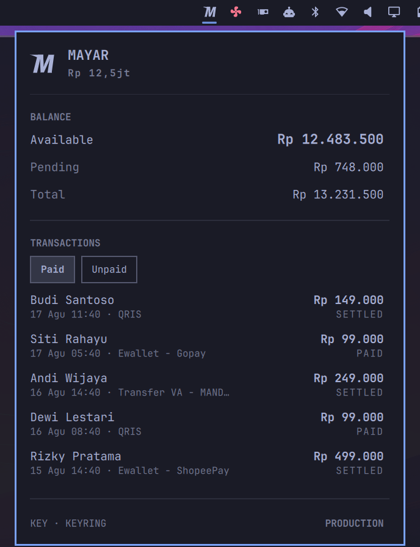
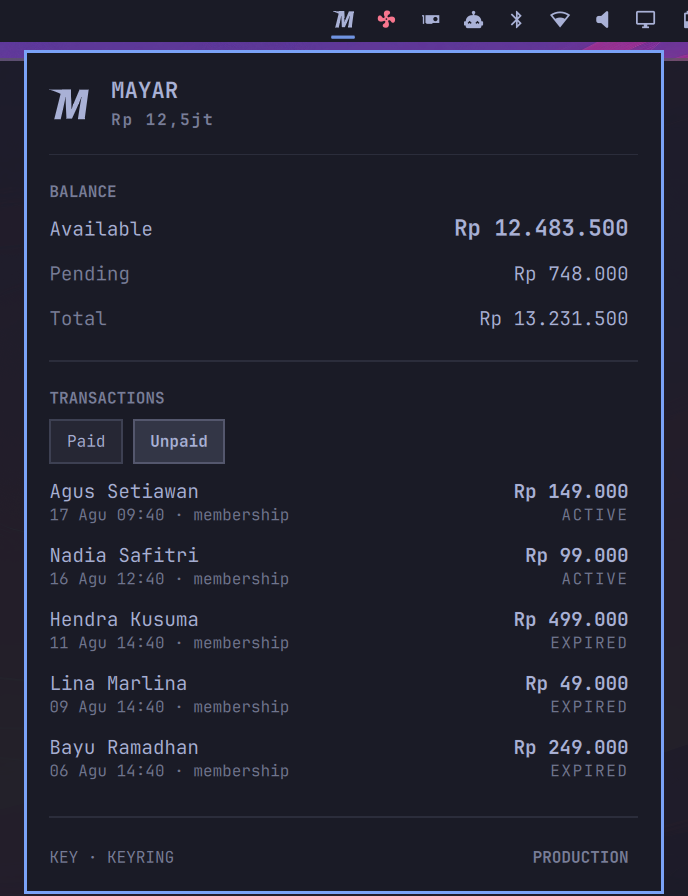

# Mayar — balance & transactions for Omarchy

A bar widget for [Mayar](https://mayar.id) merchants: your available balance in
the bar, and paid / unpaid transactions one click away.

An Omarchy port of [mayar-chrome-ext](https://github.com/moerdowo/mayar-chrome-ext),
moved to **API v2**.

| Paid | Unpaid |
| --- | --- |
|  |  |

<sub>Screenshots use made-up merchant data. The theme is whatever yours is —
the widget takes its colours from the bar.</sub>

## Install

```bash
omarchy plugin add https://github.com/moerdowo/omarchy-mayar.git --enable --yes
~/.config/omarchy/plugins/io.github.moerdowo.mayar/bin/mayarctl login
```

No `sudo` and no privilege setup: this plugin reads an HTTP API and touches no
hardware. The only thing it needs is a key.

## Logging in

Mayar has **no login endpoint**. API v2 authenticates with
`Authorization: Bearer <api-key>` and nothing else — the only "login" in the
docs is a magic link that signs your *customers* into their own portal. So
there are two ways in, and they are the same credential:

### 1. `mayarctl login` (recommended)

```bash
mayarctl login
```

Prompts for the key without echoing it, verifies it against `/balances`, and
stores it in your login keyring via `secret-tool`. Nothing is written if the
key is rejected. `mayarctl logout` removes it.

The key never appears in a dotfile, in your shell history, or in this repo.

### 2. An API key in the environment

```bash
export MAYAR_API_KEY=...
```

For headless machines, or a one-off against a different account:

```bash
MAYAR_API_KEY=... mayarctl paid -n 5
```

There is also a file fallback at
`~/.config/omarchy/mayar/apikey` — one line, `chmod 600`. It is last in
precedence and exists for machines with no keyring daemon running.

**Precedence:** `MAYAR_API_KEY` → keyring → config file.

Get a key at **Integrasi › Api Keys & Token**
([web.mayar.id/integration/apikey](https://web.mayar.id/integration/apikey)).
A **Read Only** key is enough — this plugin never issues a POST.

## Sandbox

```bash
export MAYAR_ENV=sandbox
```

Points everything at `api.mayar.io` instead of `api.mayar.id`. Sandbox and
production are separate accounts with separate keys, so the panel labels which
one it is showing rather than leaving it ambiguous.

## The panel

- **Balance** — available (withdrawable), pending, and total, in IDR.
- **Paid** — recent settled transactions: who paid, how much, when, by what
  method.
- **Unpaid** — outstanding payment requests with their status (`active` /
  `expired`).
- Click or press <kbd>Enter</kbd> on a row to copy its payment URL — or its
  transaction id, for paid rows that have no URL.

In the bar the widget is just the Mayar mark, drawn in your theme's foreground
so it sits with the rest of the row rather than shouting brand colours at it.
Hover for the balance; the mark fades when something needs you — no key, a
rejected key, or numbers it could not refresh.

## CLI

`bin/mayarctl` is the whole implementation — the panel only renders its JSON.
Everything the widget shows is available in a terminal:

```bash
mayarctl status          # everything the panel needs, one JSON object
mayarctl balance         # {"data":{"balanceActive":…,"balancePending":…,"balance":…}}
mayarctl paid -n 20      # up to 50
mayarctl unpaid
mayarctl auth            # where the key is coming from, and which environment
mayarctl login / logout
mayarctl refresh         # drop the response cache
```

Add `-f` to bypass the cache on any read.

Requires `curl` and `jq`; `secret-tool` (from `libsecret`) only for
`login` / `logout`.

## Caching

Responses are cached for 60s under `~/.cache/omarchy-mayar`, so the bar's poll
cadence is decoupled from how often the API is actually hit — Mayar does not
publish a rate limit, and a widget that polls should not be the thing that
finds it. Override with `MAYAR_CACHE_TTL` (seconds).

If a request fails but a cached response exists, the panel keeps showing the
last known numbers and labels them **STALE**, rather than blanking out.

## API endpoints used

All documented at [docs.mayar.id](https://docs.mayar.id), base
`https://api.mayar.id/hl/v2`:

- `GET /balances`
- `GET /transactions?limit=`
- `GET /transactions/unpaid?limit=`

## Project layout

```
manifest.json     # Omarchy plugin manifest
Panel.qml         # bar widget + panel — rendering only, no network, no key
MayarIcon.qml     # the brand mark, as themed Shape paths
bin/mayarctl      # API, credentials, caching, JSON for the panel
docs/             # screenshots used by this README
```

## License

MIT
